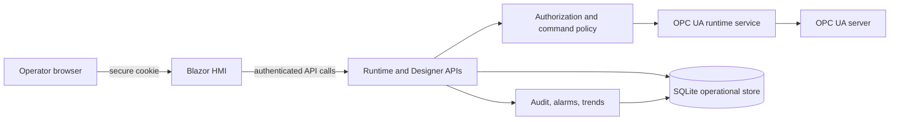

# IOTSnap HMI v1 Execution Plan

## 1. Product objective

Deliver a shippable, local-first, edge-hosted HMI for one operational site. The first release must let authorized users configure an OPC UA connection, publish operator screens, observe live values and alarms, issue controlled writes, inspect durable trend history, and prove who performed every consequential action.

The product must answer, with durable evidence:

> Who issued or acknowledged an operational command; which published screen and binding authorized it; what value was requested and observed; what OPC UA result occurred; and how can the action, alarm state, and related trend data be traced after a restart?

## 2. Non-negotiable engineering rules

1. **Operator safety before feature count.** No runtime action can bypass server-side authorization, configured binding policy, validation, confirmation policy, or audit.
2. **The server is authoritative.** Runtime UI permissions and request-body actor names are presentation hints, never authorization or audit authority.
3. **Published screens are controlled artifacts.** Runtime reads only published payloads; edits become runtime-visible only through an explicit publish operation.
4. **OPC UA writes require evidence.** A completed command records the authenticated actor, screen, widget, binding, requested typed value, OPC UA response, timestamps, and final status. A successful transport response is not a confirmed process outcome.
5. **Alarm and audit records are durable.** Acknowledgements and actions survive application restart. Corrections append a new record; they do not rewrite historical evidence.
6. **Trend history is data, not UI state.** Trend samples must be persisted with retention, time range, and deterministic downsampling. An in-memory chart buffer is only a temporary display aid.
7. **Configuration and secrets are separate.** OPC endpoints and mappings are configuration; passwords, certificates, and protected keys are never exposed in API responses, browser state, logs, or unprotected SQLite fields.
8. **Graceful degradation is explicit.** Disconnected OPC UA sessions, stale values, failed writes, persistence errors, and runtime refresh failures remain visible and cannot be presented as healthy operation.
9. **Validate at ingress and persistence boundaries.** APIs give useful errors; domain/application policy and database constraints protect against races and alternate callers.
10. **Tests prove operational behavior.** A feature is incomplete until its authorization, failure, persistence, and restart behavior have focused automated coverage.

## 3. Fixed v1 scope

### Included

- Local cookie-authenticated Admin, Operator, and Viewer users.
- OPC UA connection profiles, node mappings, subscriptions, health/quality indicators, and reconnect behavior.
- Draft and published HMI screens with Numeric, Command Button, and Trend Chart widgets.
- Server-enforced runtime navigation, numeric input constraints, command confirmation, and write feedback.
- Active alarm list, acknowledgement, severity, history, and durable action audit.
- Persisted time-series samples, range queries, retention, and chart downsampling.
- HMI project import/export for screens and bindings.
- Local deployment package, structured diagnostics, backup/restore instructions, and a representative acceptance test with an OPC UA server.

### Explicitly deferred

- Multi-site tenancy, cloud hosting, and remote identity providers.
- Recipes, reports, and advanced faceplate/template libraries.
- Generic AI control of equipment, autonomous writes, or direct database access by agents.
- Historian-scale analytics, unlimited retention, and advanced reporting.
- Pixel-perfect SCADA parity, general-purpose dashboarding, and broad asset management.

Adding a deferred capability requires a scoped design decision, threat/risk review where it affects control or identity, and acceptance tests.

## 4. Current baseline

Already implemented or in progress:

- First-run setup, local authentication, role model, SQLite migrations, user and settings administration.
- OPC UA connection profiles, node mappings, live tag snapshots, typed writes, stale/quality indicators, and persisted alarm state.
- Designer screen/widget/binding storage, admin CRUD, publishing, runtime payload API, and HMI package import/export.
- Runtime support for Numeric, Command Button, and Trend Chart widgets, including current work on alarm summaries, navigation, touch input, and chart presentation.

Known gaps that block a release:

- Runtime write and alarm acknowledgement APIs do not yet enforce widget/binding-specific roles at the server boundary.
- Acknowledge identity is currently client-supplied rather than derived from authenticated claims.
- Command completion does not yet confirm observed tag state or record a complete durable audit trail.
- Trend history is currently display-local and cannot satisfy playback, retention, or restart requirements.
- OPC UA credentials require protected storage and redaction guarantees.
- Deployment, recovery, performance, integration, and browser acceptance evidence does not yet exist.

## 5. Architecture and ownership boundary

- `Components` owns UI presentation and never establishes authorization or audit identities.
- `Features/Designer` owns screen schema, publishing contract, runtime API contracts, and screen/binding policy resolution.
- `Runtime/OpcUa` owns OPC UA connections, subscriptions, typed writes, transport diagnostics, and observed tag state.
- Data models/migrations own durable state and relational constraints.
- A new application-level command/audit service owns authorization decisions, command lifecycle, actor attribution, and transaction boundaries; neither Razor pages nor raw endpoint handlers own these rules.

## 6. Global definition of done

Every completed work item must satisfy all applicable conditions:

- Its behavior is specified, server-enforced, and covered by unit/integration tests.
- Authorization is tested for Admin, Operator, Viewer, unauthenticated, and direct API callers.
- User-visible failures provide a bounded diagnostic message and structured server logging without secrets.
- Persistent changes have a reviewed EF Core migration and upgrade/restart test where relevant.
- Mutations have cancellation, validation, race/idempotency, and audit behavior defined.
- Runtime/user-facing changes have touch and desktop browser validation.
- Documentation, API contract, operational runbook, and acceptance checklist change with the implementation.
- `dotnet build IOTSnap.Hmi.slnx` and `dotnet test IOTSnap.Hmi.slnx` pass from a clean restore.

## 7. Execution protocol

1. Complete work items in dependency order; do not start an adjacent product slice while its control or persistence prerequisite is incomplete.
2. Preserve current uncommitted runtime work, complete it as one reviewed slice, and establish a green baseline before widening scope.
3. Add focused tests before or alongside each behavior change; compilation alone never closes an item.
4. Use EF Core migrations for persistent schema changes. Do not hand-edit deployed databases.
5. For every write path, test direct API calls in addition to UI behavior.
6. Record a short design decision before changing auth/session semantics, command confirmation semantics, data retention, secret storage, or deployment topology.
7. Keep v1 deployment local/single-site until a later plan explicitly adds multi-instance or remote operations.

## Implementation Work Items

## Milestone 0 - Stabilize baseline and freeze v1 contracts

### HMI-001 - Complete and validate the current runtime enhancement slice

**Depends on:** none.

**Implement:** Finish the current changes for runtime alarm summary, screen navigation, touch input, formatting/range behavior, and chart display. Ensure one runtime refresh loop runs per page instance and that navigation does not create duplicate polling loops.

**Tests:** Existing runtime helper tests plus component/integration tests for refresh-loop lifecycle, screen navigation, alarm presentation states, input bounds, and SVG/chart output.

**Acceptance:** The working tree is intentionally scoped; clean restore, build, and tests pass; a published screen renders without duplicate requests after parameter changes.

**Non-goals:** Durable historian storage or control authorization redesign.

### HMI-002 - Establish release contracts and acceptance fixtures

**Depends on:** HMI-001.

**Implement:** Define sample OPC UA mappings, published screens, role matrix, normal/failure command cases, expected alarms, and trend data for one representative demo process. Add a written factory acceptance script and maintain sanitized seed data.

**Tests:** Database-seed/migration test; contract tests for published payloads and runtime API error formats.

**Acceptance:** Every later feature has a stable end-to-end scenario and expected result; no release criterion depends on a manually improvised PLC setup.

**Non-goals:** Production PLC commissioning.

## Milestone 1 - Control safety and durable audit

### HMI-010 - Introduce server-side runtime policy resolution

**Depends on:** HMI-002.

**Implement:** Resolve a runtime action from authenticated user claims, published screen, widget, binding, source node, and configured mapping. Enforce `MinRole`, binding source type, write intent, mapping writability, and screen publication state inside the API/application boundary. Remove trust in client-provided actor names.

**Tests:** Direct API denial tests for unauthenticated users, Viewers, invalid screen/widget/binding paths, unpublished screens, wrong node IDs, and role escalation attempts; positive Operator/Admin cases.

**Acceptance:** A direct HTTP request cannot write or acknowledge an alarm unless the authenticated user is authorized for the exact configured target.

**Non-goals:** Per-user custom permissions or external identity integration.

### HMI-011 - Implement command lifecycle, confirmation, and idempotency

**Depends on:** HMI-010.

**Implement:** Add a command request model with command ID, actor, target, typed requested value, confirmation requirement, status, timeout, OPC UA response, observed value/result, and correlation ID. Require explicit server-side confirmation for bindings marked `WriteRequiresConfirm`. Reject accidental duplicate submissions with an idempotency key.

**Tests:** Typed conversion failures, confirmation required/accepted/rejected, write transport failure, timeout, duplicate request, concurrent command, observed-value match/mismatch, and cancellation.

**Acceptance:** The runtime displays Requested, Accepted, Confirmed, Timed Out, or Failed state; it never labels a write as confirmed solely because the UI sent it.

**Non-goals:** Closed-loop process control or safety PLC logic.

### HMI-012 - Add immutable operator action audit

**Depends on:** HMI-010 and HMI-011.

**Implement:** Add audit entities/migration for writes, acknowledgements, publish/unpublish, user administration, and communications configuration changes. Capture actor from claims, role, action type, resource identifiers, request/operation IDs, before/after representation with secret redaction, result, and timestamps. Expose an admin audit query with bounded filtering/paging.

**Tests:** Audit completeness, spoofed actor rejection, failure audit behavior, pagination/filtering, redaction, transaction rollback, and restart persistence.

**Acceptance:** Each controlled action is traceable from the API result to one durable audit record, including denied or failed critical commands where policy permits recording them.

**Non-goals:** External SIEM integration.

### HMI-013 - Protect OPC UA credentials and configuration changes

**Depends on:** HMI-012.

**Implement:** Replace plaintext profile-password persistence with protected local secrets, redact sensitive values from views/APIs/logs, and require Admin authorization plus audit for connection profile changes. Define local certificate directory ownership and backup handling.

**Tests:** API/view/log redaction, protected-value round trip, migration from existing development data, unauthorized configuration mutation, and connection failure without credential disclosure.

**Acceptance:** Secrets cannot be retrieved through standard UI/API/database export paths and changes to communications configuration are auditable.

**Non-goals:** Enterprise HSM/KMS or cloud secret management.

## Release Gate A - Controlled runtime foundation

Gate A passes only when HMI-001 through HMI-013 are complete, the solution builds/tests from a clean restore, and the representative scenario proves:

- Viewer cannot write or acknowledge.
- Operator can perform only authorized, confirmed actions.
- Actor identity comes from authentication, not client JSON.
- Write outcomes and acknowledgement actions have durable audit records.
- Secrets are redacted from browser/API/log evidence.

Do not add historian or designer productivity work ahead of these controls.

## Milestone 2 - Alarms, historian, and OPC UA resilience

### HMI-020 - Complete alarm lifecycle and history [Complete]

**Depends on:** Release Gate A.

**Implement:** Extend alarm state with severity, source/transition timestamps, active/acknowledged/cleared lifecycle, acknowledgement actor, optional shelving policy, and bounded history query API. Derive runtime alarm lists from durable records rather than page-local state.

**Tests:** Raise/clear/re-raise, acknowledge before/after clear, severity ordering, history filters, restart, concurrent acknowledge, and role authorization.

**Acceptance:** Operators can distinguish active unacknowledged, active acknowledged, and cleared history; every transition is durable and attributable.

**Non-goals:** Full OPC UA Alarms & Conditions event-model support if unavailable from the target server; v1 may derive alarms from configured quality/value rules.

**Evidence:** `OpcUaRuntimeAlarmTests` covers severity ordering, acknowledgement idempotency, acknowledgement after clear, durable restart-visible state, and raised/acknowledged/cleared/re-raised transitions. `RuntimeApiAuthorizationTests` covers authenticated bounded history access. Full suite passes with 44 tests.

### HMI-021 - Build persisted trend sampling and query API [Complete]

**Depends on:** Release Gate A.

**Implement:** Persist samples for configured trend tags with timestamp, value/quality, source mapping, retention policy, and batching. Add a range API with input limits and deterministic downsampling. Replace runtime chart data from the in-memory eight-point list with API-backed series.

**Tests:** Sampling cadence, quality transitions, restart persistence, retention cleanup, range boundaries, downsampling determinism, malformed/non-numeric values, and large-range query limits.

**Acceptance:** A user can reopen a trend after restart and inspect supported time ranges with stable, bounded chart data.

**Non-goals:** Unlimited historian retention or cross-site analytics.

**Evidence:** Runtime sampling persists samples with 30-day retention; the runtime reloads persisted series. `RuntimeApiAuthorizationTests` proves authenticated bounded range queries and deterministic downsampling from persisted SQLite data. `RuntimeTrendDownsamplingTests` covers the downsampling contract. Full suite passes with 45 tests.

### HMI-022 - Harden OPC UA reconnect and data quality behavior [Complete]

**Depends on:** HMI-020 and HMI-021.

**Implement:** Define reconnect backoff, terminal failure state, subscription rebuild rules, snapshot freshness/deadband configuration, status diagnostics, and user-visible connection degradation. Ensure profile changes safely reconnect and stale state cannot be interpreted as current.

**Tests:** Server unavailable at startup, disconnect/reconnect, session loss, subscription rebuild, profile disable/enable, stale timeout, noisy tag deadband, and write attempt while disconnected.

**Acceptance:** The runtime makes connection state and stale/invalid data unambiguous; recovery does not duplicate subscriptions or silently discard errors.

**Non-goals:** OPC UA redundancy/failover across multiple servers.

**Evidence:** `OpcUaReconnectPolicyTests` covers bounded exponential backoff and reset behavior. `OpcUaRuntimeConnectivityTests` covers disconnected write rejection and degraded profile status. Alarm lifecycle tests cover stale-health normalization; runtime subscription signatures prevent duplicate subscription rebuilds when mappings are unchanged. Full suite passes with 52 tests.

## Milestone 3 - Operator and designer workflow completion

### HMI-030 - Deliver operator runtime workflow [Complete]

**Depends on:** HMI-020 through HMI-022.

**Implement:** Finalize multi-screen navigation, alarm banner/history, trend time windows, touch numeric entry, write confirmation/feedback, quality indicators, and role-aware control affordances. Add a runtime home/landing behavior for published screens.

**Tests:** Browser workflows for Viewer/Operator/Admin, touch-sized controls, keyboard navigation, failed write recovery, stale data, alarm acknowledgement, navigation, and trend playback.

**Acceptance:** An operator can log in, navigate, inspect live/historical data, acknowledge an authorized alarm, issue a confirmed write, and understand its final state without the designer page.

**Non-goals:** Advanced faceplate libraries.

**Evidence:** The runtime includes multi-screen navigation, active/history alarm presentation, touch keypad input, trend windows, confirmation feedback, quality state, and role-aware control affordances. `/runtime` resolves the first published screen. `RuntimeOperatorPermissionsTests` proves Viewer read-only versus Operator/Admin controls; runtime, policy, alarm, trend, and command suites pass with 56 total tests.

### HMI-031 - Finish designer validation and publish workflow [Complete]

**Depends on:** HMI-010, HMI-021, and HMI-030.

**Implement:** Validate layouts, supported widgets, property JSON, tag existence/type, writable command bindings, min/max/scaling rules, roles, duplicate keys, and navigation targets before save/publish. Surface publish validation errors in the designer. Add publish audit/history and a safe rollback-to-previous-published payload design.

**Tests:** Invalid layout/binding/property cases, incompatible tag types, non-writable command, unauthorized publish, publish/unpublish race, rollback, and runtime payload immutability.

**Acceptance:** An invalid or unsafe screen cannot be published; a prior valid published version can be restored with traceable evidence.

**Non-goals:** Drag-and-drop canvas redesign or template marketplace.

**Evidence:** Save and publish validation rejects malformed property JSON, invalid ranges, duplicate widget keys/binding roles, unsafe layout, unmapped tags, and read-only command targets. Every publish creates an immutable `HmiScreenPublication` snapshot; rollback restores and revalidates a selected snapshot and creates an audit event. `HmiScreenPublicationTests` verifies SQLite persistence. Full suite passes with 57 tests.

### HMI-032 - Complete HMI package lifecycle [Complete]

**Depends on:** HMI-031.

**Implement:** Add package schema validation/version handling, asset size/type limits, import preview, conflict policy, author/source metadata, and audit. Preserve source package evidence without allowing unvalidated imports to publish.

**Tests:** Round trip, old/new version compatibility, malformed archive, oversized asset, duplicate slug/key, import-preview versus commit, and unpublished imported screen.

**Acceptance:** Screens can be transferred between approved installations without bypassing validation, publish control, or audit.

**Non-goals:** Arbitrary third-party asset execution or cloud package registry.

**Evidence:** Package intake validates format/version, dimensions, widget limits, duplicate keys, archive size, and asset size before use. Package metadata preserves author/source fields and import remains draft-first. `HmiPackageRoundTripTests` and `HmiProjectArchiveTests` cover round-trip, incompatible versions, malformed/duplicate payloads, and oversized assets. Full suite passes with 60 tests.

## Milestone 4 - Production operability and release evidence

### HMI-040 - Add diagnostics, health, and performance evidence [Complete]

**Depends on:** HMI-022 and HMI-030.

**Implement:** Structured logs and metrics for startup, migrations, OPC UA connections/subscriptions, command lifecycle, alarm transitions, sampling, and runtime API latency. Make `/healthz` liveness-only and `/readyz` reflect database/migration/runtime readiness without exposing secrets.

**Tests:** Degraded dependency behavior, health endpoint semantics, log redaction, bounded metric labels, diagnostics on slow/failing OPC UA operations, and runtime load at agreed tag/screen counts.

**Acceptance:** A support user can identify the current runtime/database/OPC health and correlate a failed operator action without inspecting source code.

**Non-goals:** A hosted observability platform.

**Evidence:** OPC UA runtime emits structured startup, connection, write, subscription, credential, and persistence diagnostics. `/healthz` is liveness-only; `/readyz` evaluates database/runtime readiness and returns bounded, redacted output. `RuntimeApiAuthorizationTests` proves unauthenticated liveness and disconnected-runtime readiness behavior. Full suite passes with 61 tests.

### HMI-041 - Package, upgrade, backup, and restore [Complete]

**Depends on:** HMI-012, HMI-021, and HMI-040.

**Implement:** Produce a versioned local deployment/package procedure, environment-specific configuration template, data-directory permissions guidance, pre-upgrade backup, EF migration execution, rollback/restore runbook, and retention/backup schedule.

**Tests:** Clean-machine install, first-run setup, upgrade from prior schema, restore into a clean installation, corruption/missing-data behavior, and migration failure recovery.

**Acceptance:** A designated installer can deploy, upgrade, back up, and restore the local HMI using documented steps without hand-editing the database.

**Non-goals:** High availability, clustered storage, or unattended remote updates.

**Evidence:** `docs/Deployment.md` provides clean install, automatic migration, upgrade, backup, restore, missing-key/corruption recovery, permissions, and readiness verification procedures for the actual SQLite and data-protection layout. Clean build, full test suite, and whitespace validation pass with 61 tests.

### HMI-042 - Release qualification and factory acceptance

**Depends on:** HMI-030 through HMI-041.

**Implement:** Add integration tests with an OPC UA test server, browser-level tests for critical workflows, migration/backup tests, dependency vulnerability review, and a release checklist. Run a manual acceptance scenario against a representative target OPC UA environment.

**Tests:** Authentication/authorization, publish/render, disconnected/reconnected OPC UA, alarm lifecycle, trend persistence, confirmed write, audit trace, backup/restore, and package import/export.

**Acceptance:** Critical workflows pass in automated and manual evidence; no critical/high unresolved control, data-loss, or authentication defect remains; known limitations are documented for the installer and operator.

**Non-goals:** Certification for safety-instrumented functions or validation as a replacement for PLC safety controls.

## Release Gate B - Shippable local HMI v1

Gate B passes only when:

- Release Gate A remains green.
- HMI-020 through HMI-042 are complete.
- A published screen supports numeric read, controlled command write, alarm acknowledgement, historical trend, and navigation end to end.
- Commands, acknowledgements, publishes, and communications changes are authorized, audited, and queryable.
- OPC UA disconnect/reconnect, application restart, database restore, and upgrade/migration recovery have passing evidence.
- Clean restore/build/test, integration tests, browser tests, and the documented factory acceptance checklist pass.
- The release package, configuration guide, backup/restore runbook, supported environment, and deferred limitations are published alongside the build.

## 8. First release acceptance scenario

1. Install the package on a clean local machine and complete first-run admin setup.
2. Configure a protected OPC UA profile and import or create approved tag mappings.
3. As Admin, create and validate a screen containing Numeric, Trend Chart, and Command Button widgets; publish it.
4. As Viewer, inspect the screen and verify write/acknowledge API requests are denied.
5. As Operator, navigate between published screens, inspect a persisted trend, acknowledge an authorized alarm, and issue a confirmation-required command.
6. Verify command feedback reaches a terminal state and its audit record shows authenticated actor, target, requested value, response, correlation, and timestamp.
7. Disconnect the OPC UA server; verify stale/degraded state and write rejection are clear. Restore the server and verify subscriptions recover without duplicate behavior.
8. Restart the HMI; verify alarms, audit, published screens, and trend history remain available.
9. Back up the data directory, restore it to a clean installation, and repeat the read-only verification.

## 9. Deferred roadmap boundary

The following require a later approved plan:

1. Multi-site/multi-tenant architecture and remote administration.
2. Enterprise identity, secret vault, certificate authority, and centralized monitoring selections.
3. Advanced designer templates, reusable faceplates, complex graphics, or third-party widget ecosystems.
4. Recipes, batch control, reporting, historian analytics, and large-scale data retention.
5. Remote/public agent or MCP control integrations.
6. Any claim that the HMI provides PLC or safety-instrumented control guarantees.
